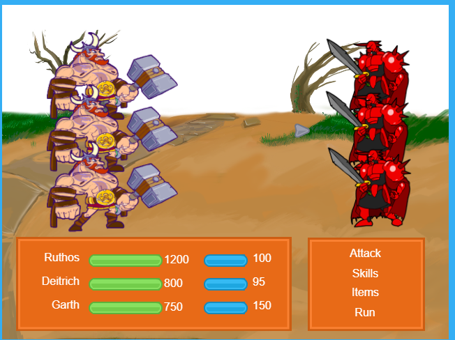

    Hemen duzu ariketa berri bat, **RPG (Role Playing Game)** estiloko borroka-sistema bat simulatzen duena. Egitura, pedagogia eta kode-maila aurrekoaren berdinak dira, baina logika apur bat aldatzen da (borroka txandak vs zaintza jarraitua).

# ⚔️ PROIEKTUA: HERO vs MONSTER (JS Battle)



--- 

  - [⚔️ PROIEKTUA: HERO vs MONSTER (JS Battle)](https://www.google.com/search?q=%23-proiektua-hero-vs-monster-js-battle)
      - [🛠️ 0. FASEA: Borroka Eremua (HTML eta CSS)](https://www.google.com/search?q=%23%EF%B8%8F-0-fasea-borroka-eremua-html-eta-css)
      - [🧠 1. FASEA: Modeloa (Osasun Puntuak)](https://www.google.com/search?q=%23-1-fasea-modeloa-osasun-puntuak)
      - [👁️ 2. FASEA: Bista (Markagailuak)](https://www.google.com/search?q=%23%EF%B8%8F-2-fasea-bista-markagailuak)
      - [💥 3. FASEA: Eguneratzea (Erasoa eta Sendaketa)](https://www.google.com/search?q=%23-3-fasea-eguneratzea-erasoa-eta-sendaketa)
      - [⏱️ 4. FASEA: Etsaiaren Txanda (Automatikoa)](https://www.google.com/search?q=%23-4-fasea-etsaiaren-txanda-automatikoa)
      - [🏆 5. FASEA: Irabazi edo Galdu (Game Over)](https://www.google.com/search?q=%23-5-fasea-irabazi-edo-galdu-game-over)
  - [🛡️ 2. MAILA: Barra Bisualak eta Magia](https://www.google.com/search?q=%23-2-maila-barra-bisualak-eta-magia)
      - [📊 6. FASEA: Osasun Barrak (CSS Dinamikoa)](https://www.google.com/search?q=%23-6-fasea-osasun-barrak-css-dinamikoa)
      - [🔥 7. FASEA: Lottie Integratzen (Efektuak)](https://www.google.com/search?q=%23-7-fasea-lottie-integratzen-efektuak)
      - [🧪 8. FASEA: Edabearen Cooldown (Mekanika)](https://www.google.com/search?q=%23%EF%B8%8F-8-fasea-edabearen-cooldown-mekanika)

**Helburua:** Heroi baten eta Munstro baten arteko borroka. Zuk munstroari eraso egin behar diozu bera garaitzeko, baina kontuz, munstroak automatikoki erasotzen zaitu denborak aurrera egin ahala. Bizirik iraun behar duzu\!
**Arkitektura:** Modeloa - Bista - Eguneratzea (MVU).

-----

## 🛠️ 0. FASEA: Borroka Eremua (HTML eta CSS)

Presta dezagun estadioa. Kopiatu hau zure fitxategian.

**HTML:**

```html
<div id="battle-app"></div>
```

**CSS (Gehitu zure estilo-orrian):**

```css
body {
    font-family: 'Verdana', sans-serif;
    background-color: #1a1a2e;
    color: white;
    text-align: center;
}

.battle-screen {
    border: 4px solid #e94560;
    width: 350px;
    margin: 20px auto;
    padding: 20px;
    border-radius: 15px;
    background-color: #16213e;
    box-shadow: 0 0 20px rgba(233, 69, 96, 0.5);
}

.fighters {
    display: flex;
    justify-content: space-between;
    margin: 30px 0;
    font-size: 50px;
}

.stats {
    display: flex;
    justify-content: space-between;
    font-size: 14px;
    font-weight: bold;
    margin-bottom: 10px;
}

.boton {
    background-color: #e94560;
    color: white;
    border: none;
    padding: 12px 20px;
    font-size: 16px;
    cursor: pointer;
    border-radius: 5px;
    margin: 5px;
    width: 45%;
}

.boton:hover { background-color: #ff6b81; }
.boton.heal { background-color: #0f3460; }
.boton.heal:hover { background-color: #533483; }

.status-msg { height: 20px; color: #fcdab7; margin-bottom: 10px; }
```

-----

## 🧠 1. FASEA: Modeloa (Osasun Puntuak)

Hemen ez dugu gosea edo zoriontasuna neurtuko, baizik eta **HP (Health Points)** edo Bizitza Puntuak.

**Zure misioa:**
Definitu bi aldagai global zure script-aren hasieran:

1.  `vidaHeroe`: `100`ean hasten da (gure bizitza).
2.  `vidaMonstruo`: `100`ean hasten da (etsaiaren bizitza).

<!-- end list -->

```javascript
// --- MODELOA ---
let vidaHeroe = 100;
let vidaMonstruo = 100;
```

-----

## 👁️ 2. FASEA: Bista (Markagailuak)

Sortu `vista()` funtzioa HTMLa marrazteko.

**Zure misioa:**
Kopiatu eta osatu funtzioa `________` hutsuneak betez.

```javascript
// --- BISTA ---
function vista() {
    document.getElementById("battle-app").innerHTML = `
        <div class="battle-screen">
            <h2>⚔️ BATTLE ARENA ⚔️</h2>
            
            <div class="stats">
                <div>HEROIA: ${________} HP</div>
                <div>MUNSTROA: ${________} HP</div>
            </div>

            <div class="fighters">
                <div>🥷</div>
                <div>👹</div>
            </div>

            <div class="controls">
                <button class="boton" id="btn-atacar">⚔️ Eraso</button>
                <button class="boton heal" id="btn-curar">🧪 Sendatu</button>
            </div>
        </div>
    `;

    // HEMEN JOANGO DIRA GERTAERAK (3. FASEA)
}

vista();
```

> **✅ PROBA:** Nabigatzailean 100 HP ikusi behar duzu bi aldeetan.

:octocat: Igo aldaketak biltegira mezu honekin: "1. Maila osatuta: Arena prest".

-----

## 💥 3. FASEA: Eguneratzea (Erasoa eta Sendaketa)

Gure heroiaren txanda da. Botoiak programatuko ditugu.

**Jokoaren logika:**

  * **Eraso:** Munstroari 10 puntu kentzen dizkiogu (`vidaMonstruo -= 10`).
  * **Sendatu:** Heroiari 15 puntu ematen dizkiogu, baina inoiz ezin da 100 baino gehiago izan.

**Zure misioa:**
Gehitu kode hau `vista()` funtzioaren barruan.

```javascript
    // --- EGUNERATZEA (Gertaerak) ---
    document.getElementById("btn-atacar").onclick = () => {
        // Munstroa bizirik badago bakarrik eraso dezakegu
        if (vidaMonstruo > 0) {
            vidaMonstruo -= 10;
            // Ezin da 0 baino txikiagoa izan (estetika)
            if (vidaMonstruo < 0) vidaMonstruo = 0;
        }
        vista();
    }

    document.getElementById("btn-curar").onclick = () => {
        // Heroia bizirik badago bakarrik sendatu daiteke
        if (vidaHeroe > 0) {
            vidaHeroe += 15;
            // 100era mugatu (tope)
            if (vidaHeroe > 100) vidaHeroe = 100;
        }
        vista();
    }
```

> **✅ PROBA:** Eraso ezazu\! Munstroaren zenbakia jaitsi behar da. Sendatu\! Zenbakia igo behar da (baina ez 100dik gora).

:octocat: Igo aldaketak biltegira mezu honekin: "1. Maila osatuta: Eraso sistema".

-----

## ⏱️ 4. FASEA: Etsaiaren Txanda (Automatikoa)

RPG honetan, munstroa ez da geldirik geratzen. "Denbora Errealeko" borroka bat da. Munstroak **segundo eta erdiro** kolpatuko zaitu, zuk erasotzen duzun ala ez kontuan hartu gabe. Presioa\!

**Zure misioa:**
Sortu `cicloDeBatalla()` funtzioa bistatik kanpo.

```javascript
// --- ETSAIAREN LOOP-A ---

function cicloDeBatalla() {
    // 1.5 segundoro (1500ms) munstroak erasotzen du
    setTimeout(() => {
        
        // Munstroa bizirik badago bakarrik erasotzen du
        if (vidaMonstruo > 0 && vidaHeroe > 0) {
            // Ausazko kaltea (5 eta 15 artean)
            let golpe = Math.floor(Math.random() * 10) + 5;
            vidaHeroe -= golpe;
            
            // Muga: ez jaitsi 0tik behera
            if (vidaHeroe < 0) vidaHeroe = 0;
            
            vista();
        }

        // Loop-a jarraitzen du jokoa amaitu arte
        if (vidaMonstruo > 0 && vidaHeroe > 0) {
            cicloDeBatalla();
        }

    }, 1500);
}

// BORROKA HASI
cicloDeBatalla();
```

> **✅ PROBA:** Ireki jokoa eta ez egin ezer. Ikusiko duzu zure bizitza jaisten doala pixkanaka. Hil egingo zara azkar ez baduzu jokatzen\!

:octocat: Igo aldaketak biltegira mezu honekin: "1. Maila osatuta: Etsaiaren IA".

-----

## 🏆 5. FASEA: Irabazi edo Galdu (Game Over)

Norbaitek 0ra iristen denean, partida amaitu da. Ikonoak eta mezuak aldatu behar ditugu.

**Zure misioa:**
Aldatu `vista()` funtzioa borrokalarien emojiak aldatzeko egoeraren arabera.

1.  Bilatu `div class="fighters"` atala.
2.  Kalkulatu egoerak.

<!-- end list -->

```javascript
    // -- BISTA BARRUAN --
    
    // Egoerak kalkulatu
    let heroeMuerto = vidaHeroe <= 0;
    let monstruoMuerto = vidaMonstruo <= 0;

    // Emojiak erabaki (Ternarioa)
    let iconoHeroe = heroeMuerto ? "⚰️" : "🥷";
    let iconoMonstruo = monstruoMuerto ? "💥" : "👹";

    // Mezu bat prestatu
    let mezua = "";
    if (heroeMuerto) mezua = "<h3 style='color:red'>GARAI TUA IZAN ZARA...</h3>";
    if (monstruoMuerto) mezua = "<h3 style='color:gold'>IRABAZI DUZU! 🏆</h3>";

    document.getElementById("battle-app").innerHTML = `
        <div class="battle-screen">
            <h2>⚔️ BATTLE ARENA ⚔️</h2>
            
            ${mezua}

            <div class="stats">... (hau berdin) ...</div>

            <div class="fighters">
                <div>${iconoHeroe}</div>
                <div>${iconoMonstruo}</div>
            </div>
            ...
```

**⚠️ Erronka Extra:**
Jokoa amaitzen denean (irabazi edo galdu), botoiek ez lukete funtzionatu behar. Bildu botoien `onclick` logika `if (!heroeMuerto && !monstruoMuerto)` baten barruan.

:octocat: Igo aldaketak biltegira mezu honekin: "1. Maila OSATUTA: Game Over".

-----

# 🛡️ 2. MAILA: Barra Bisualak eta Magia

**Helburua:** Zenbakiak aspergarriak dira. "Barra de vida" klasikoak sortuko ditugu CSS erabiliz eta Lottie animazioak gehituko ditugu borroka epikoagoa izan dadin.

-----

## 📊 6. FASEA: Osasun Barrak (CSS Dinamikoa)

Zenbaki soilen ordez, kolorezko barrak nahi ditugu.

**6.1 Urratsa: CSSa gehitu**
Gehitu hau zure estiloetan.

```css
.health-bar-container {
    background-color: #333;
    width: 100%;
    height: 10px;
    border-radius: 5px;
    margin-top: 5px;
    overflow: hidden;
}

.health-bar {
    height: 100%;
    transition: width 0.3s ease; /* Animazio leuna jaisten denean */
}
```

**6.2 Urratsa: Bista aldatu**
`vista()` funtzioan, zenbakiak erakusten dituen `stats` atala aldatuko dugu. `style="width: ${vida}%"` trikimailua erabiliko dugu.

```javascript
    // Kolorea kalkulatu (Berdea ondo badago, Gorria hilzorian)
    let colorHeroe = vidaHeroe > 30 ? "#4caf50" : "#f44336"; 
    
    // HTML barruan:
    <div class="stats">
        <div style="width: 45%">
            <div>Heroia: ${vidaHeroe}</div>
            <div class="health-bar-container">
                <div class="health-bar" style="width: ${vidaHeroe}%; background-color: ${colorHeroe}"></div>
            </div>
        </div>
        <div style="width: 45%">
            <div>Munstroa: ${vidaMonstruo}</div>
            <div class="health-bar-container">
                <div class="health-bar" style="width: ${vidaMonstruo}%; background-color: #e94560"></div>
            </div>
        </div>
    </div>
```

> **✅ PROBA:** Orain, kaltea jasotzean, barra bisualki txikitu behar da.

-----

## 🔥 7. FASEA: Lottie Integratzen (Efektuak)

Emoji estatikoen ordez, animazioak jarriko ditugu.

**7.1 Urratsa:** Inportatu Lottie script-a (Tamagotchi-an bezala).

**7.2 Urratsa:** Ordezkatu emojiak Lottie Playerekin.
Munstroa hiltzen denean, leherketa bat jarriko dugu.

```javascript
    // Bista barruan aldagaiak prestatu
    let animacionMonstruo = monstruoMuerto 
        ? "https://assets9.lottiefiles.com/packages/lf20_96bovdur.json" // Leherketa
        : "https://assets4.lottiefiles.com/packages/lf20_15gr10.json";  // Munstroa mugitzen
    
    // HTMLan txertatu
    <div class="fighters">
        <div style="width:100px">
             <lottie-player src="https://assets2.lottiefiles.com/packages/lf20_s0lwaq2n.json" background="transparent" speed="1" style="width: 100px; height: 100px;" loop autoplay></lottie-player>
        </div>
        <div style="width:100px">
            <lottie-player src="${animacionMonstruo}" background="transparent" speed="1" style="width: 100px; height: 100px;" loop autoplay></lottie-player>
        </div>
    </div>
```

:octocat: Igo aldaketak biltegira mezu honekin: "2. Maila 1. zatia: Barrak eta Animazioak".

-----

## 🧪 8. FASEA: Edabearen Cooldown (Mekanika)

Ezin duzu etengabe sendatu ("Spam"). Edabeak 3 segundo behar ditu kargatzeko.

**8.1 Urratsa: Modeloa**

```javascript
let potionCooldown = false; // Edabea prest?
```

**8.2 Urratsa: Bista (Botoia desgaitu)**

```javascript
<button class="boton heal" id="btn-curar" ${ potionCooldown ? "disabled" : "" }>
    ${ potionCooldown ? "Kargatzen..." : "🧪 Sendatu" }
</button>
```

**8.3 Urratsa: Logika (Update)**

```javascript
    document.getElementById("btn-curar").onclick = () => {
        if (vidaHeroe > 0 && !potionCooldown) { // Cooldown ez badago
            vidaHeroe += 20; 
            if (vidaHeroe > 100) vidaHeroe = 100;
            
            // 1. Blokeatu
            potionCooldown = true;
            vista();

            // 2. Itxaron 3 segundo (3000ms)
            setTimeout(() => {
                potionCooldown = false; // Desblokeatu
                vista();
            }, 3000);
        }
    }
```

> **🏆 AZKEN EMAITZA:**
> RPG joko txiki bat daukazu. Munstroak automatikoki erasotzen du, eta zuk erabaki behar duzu noiz eraso eta noiz sendatu (kontuan hartuta sendatzeko itxaron egin behar duzula). Estrategia beharrezkoa da\!